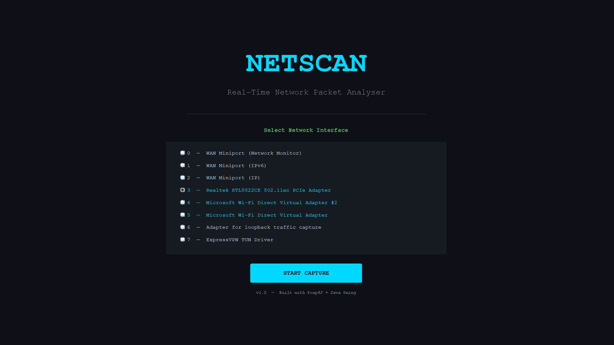
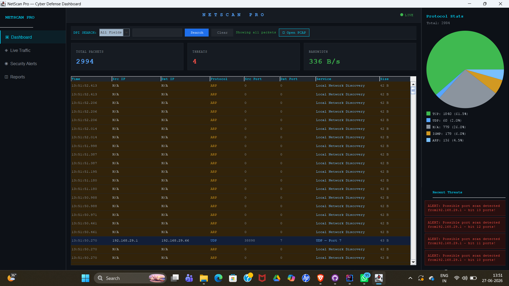

# 🛡️ PacketAnalyzer — NetScan Pro

> A real-time network packet analyzer and cyber defense dashboard built in Java.


---

## 📌 About

**PacketAnalyzer (NetScan Pro)** is a Java-based network packet analyzer that captures live traffic directly from your Network Interface Card (NIC). It provides a professional dark-themed dashboard for monitoring network activity, detecting security threats, and analyzing saved PCAP capture files.

This is **not** a Wireshark wrapper — it captures and displays packets natively using **Pcap4J**, giving you full control over packet inspection and analysis.

---

## ✨ Features

| Feature | Description |
|---------|-------------|
| ✅ **Live NIC Traffic Capture** | Capture packets in real-time from any network interface |
| ✅ **Real-Time Protocol Stats** | Live pie chart — TCP, UDP, ARP, ICMP breakdown |
| ✅ **Security Threat Detection** | Automatically detects suspicious network activity |
| ✅ **PCAP File Support** | Load and analyze previously saved capture sessions |
| ✅ **Auto Save Captures** | Every session automatically saved as a .pcap file |
| ✅ **DPI Search** | Deep packet inspection search across all fields |
| ✅ **Dark Cyber Dashboard** | Professional dark-themed Java Swing UI |

---

## 🛠️ Tech Stack

| Technology | Version | Purpose |
|------------|---------|---------|
| **Java** | 17 | Core programming language |
| **Pcap4J** | 1.8.2 | Native packet capture from NIC |
| **Java Swing** | Built-in | Dark-themed GUI dashboard |
| **Maven** | 3.x | Build tool and dependency management |
| **Npcap** | Latest | Windows network driver for capture |

---

## 🚀 Getting Started

### Prerequisites

| Requirement | Installation Guide |
|-------------|-------------------|
| **Java 17+** | [Download Oracle JDK](https://www.oracle.com/java/technologies/downloads/) or [OpenJDK](https://adoptium.net/) |
| **Maven 3.x** | [Download Maven](https://maven.apache.org/download.cgi) |
| **Npcap** | [Download Npcap](https://npcap.com/) *(Required for Windows)* |
| **Git** | [Download Git](https://git-scm.com/downloads) |
| **IntelliJ IDEA** (optional) | [Download IntelliJ](https://www.jetbrains.com/idea/download/) |
`````

2. Open in **IntelliJ IDEA**

3. Build with Maven
```bash
mvn clean install
```

4. Run `MainWindow.java`

5. Select your network interface when prompted

6. Packets start flowing in real time! 🚀

---

## 📁 Project Structure

`````
src/
└── main/java/org/example/
    ├── capture/
    │   ├── DeviceManager.java          # Network interface manager
    │   └── PacketCaptureThread.java    # Live capture thread
    ├── gui/
    │   ├── MainWindow.java             # Main dashboard window
    │   ├── PacketTablePanel.java       # Packet display table
    │   ├── PayloadSearchPanel.java     # DPI search panel
    │   ├── SplashScreen.java           # Splash screen
    │   └── StatsPanel.java             # Protocol stats & pie chart
    ├── parser/
    │   ├── PacketModel.java            # Packet data model
    │   └── PacketParser.java           # Protocol parser
    └── Stats/
        ├── AlertEngine.java            # Threat detection engine
        ├── PcapFileReader.java         # Load PCAP files
        ├── PcapFileWriter.java         # Save captures to PCAP
        └── StatsCollector.java         # Statistics collector
`````

---

## 📸 Preview




## 👩‍💻 Author

**Aqusa Fatima** — [@Aqusa06](https://github.com/Aqusa06)

---

⭐ *If you find this project useful, please give it a star — it means a lot!*
`````


